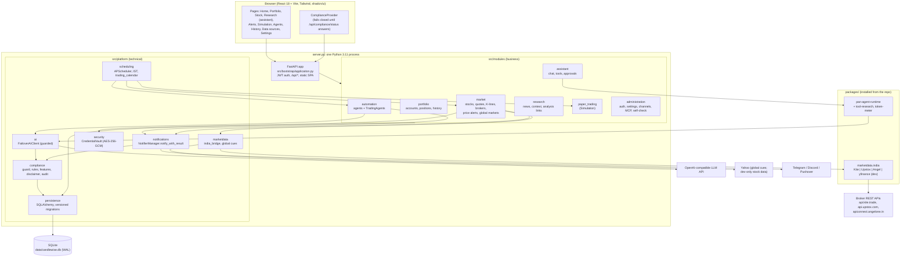

# Architecture

This describes the code as it is on `feat/ui-lamplight` (2026-09-27). Module boundaries
are explained in more depth in [`src/ARCHITECTURE.md`](../src/ARCHITECTURE.md). The
upstream PanWatch architecture, and what changed from it, is in
[`india-fork/ARCHITECTURE.md`](india-fork/ARCHITECTURE.md).

## At a glance

- **Shape:** a modular monolith. One Python process runs the FastAPI API, the schedulers
  and the static frontend. It uses one SQLite database.
- **Users:** one per installation. There is no multi-tenancy (see
  [Multi-tenancy](#multi-tenancy)).
- **Market data:** from the owner's own broker API connection, read-only.
- **AI:** any OpenAI-compatible endpoint. Every output passes the compliance guard.

The architecture test (`tests/test_architecture_boundaries.py`) enforces these rules:
`platform` never imports `modules`, and modules don't import each other's ORM internals.

## Backend

- **Entry point.** `server.py` configures logging, runs database migrations, seeds
  agents, starts the schedulers and serves the API on port 8000. The frontend build is
  served from `static/` (in the Docker image).
- **App.** `src/bootstrap/application.py` builds the FastAPI app. Most `/api/*` routers
  depend on `get_current_user`; auth and compliance are mounted without it.
  `/api/health` answered 200 without a token on a local run with a password set.
- **Auth.**
  - There is one account: a username and a password hash stored in `app_settings`.
  - The browser gets a JWT (HS256, valid 30 days, subject `"user"`) and keeps it in
    `localStorage`.
  - **Until a password is set, the API is open.** That is how the setup screen works
    (`src/modules/administration/api/auth.py`).
  - Passwords are hashed with unsalted SHA-256, and CORS allows `*`. Both are go-live
    blockers ([GO-LIVE-CHECKLIST.md](GO-LIVE-CHECKLIST.md)).
- **Configuration.** Pydantic `Settings` in `src/platform/runtime/config.py` reads `.env`
  and the environment. Some settings can also be edited in the UI and are stored in
  `app_settings`. See [SETUP.md](SETUP.md#environment-variables).
- **Observability.**
  - Structured logs with a `trace_id`, stored in the `log_entries` table and shown in the
    in-app log viewer.
  - Agent runs are recorded in `agent_runs`.
  - OpenTelemetry export is optional (`requirements-otel.txt`,
    `OTEL_EXPORTER_OTLP_ENDPOINT`).
  - The health endpoint is `/api/health`.

## Frontend

- **Location.** `frontend/` is a pnpm workspace:
  - `src/` holds the pages and app components;
  - `packages/api` (`@candlewise/api`) is the only HTTP client;
  - `packages/base-ui` holds the shadcn primitives;
  - `packages/biz-ui` holds the business components.
- **Toolchain.** Node 24.14.0 (`engines`, `.nvmrc`), pnpm 9.15.9, Vite and Vitest.
- **Routes** (`src/App.tsx`):

  | Route | Page |
  | --- | --- |
  | `/` | Home |
  | `/portfolio` | Portfolio |
  | `/stock/:symbol` | Stock |
  | `/analysis/:symbol/:date` | Research report |
  | `/assistant` | Research (the assistant) |
  | `/alerts` | Alerts |
  | `/paper-trading` | Simulation |
  | `/agents` | Agents |
  | `/history` | History |
  | `/datasources` | Data sources |
  | `/settings` | Settings |
  | `/opportunities`, `/evaluations` | Only when those features are enabled; they aren't in research-only mode |
  | `/login` | Login |

- **Design system.** The "Lamplight" tokens are in `src/index.css`. Price moves are shown
  only through `<Change>`, and formatting goes through `src/lib/format.ts` (INR in
  lakh/crore, IST).
- **Compliance on the client.** `ComplianceProvider` reads `/api/compliance/status` and
  hides gated features. The disclaimer consent dialog blocks the app until the current
  disclaimer version is acknowledged.

## Agents and schedules

Agents are seeded from `src/modules/automation/agent_catalog.py`. Cron expressions are
evaluated in the app timezone, which defaults to `Asia/Kolkata` (`APP_TIMEZONE` / `TZ`).

| Agent | Default | Schedule (IST) | Output |
| --- | --- | --- | --- |
| Pre-market outlook (`premarket_outlook`) | off | `0 9 * * 1-5`: 09:00 Mon–Fri | `research` items + guarded Markdown |
| Intraday monitor (`intraday_monitor`) | off | `*/5 9-15 * * 1-5`: every 5 min from 09:00 to 15:55 Mon–Fri | intraday observation (notable / headline / observations / levels / risks) |
| Daily close report (`daily_report`) | **on** | `30 15 * * 1-5`: 15:30 Mon–Fri | `research` items + guarded Markdown |
| News digest (`news_digest`) | off, hidden | none (a capability used by other agents) | `research` items |
| TradingAgents deep research (`tradingagents`) | off | none (run on demand from the Stock page) | neutral research summary (ADR-005) |

The plan asked for 08:45, a 09:15–15:30 intraday window and 16:00. The seeds above differ
from that. The intraday monitor fires from 09:00, but skips stocks outside the
09:15–15:30 session (`is_market_trading` in `src/modules/automation/intraday_monitor.py`)
unless a manual run bypasses the market-hours check.

Other scheduled jobs:

| Job | When |
| --- | --- |
| Price alert scan | every 60 s |
| Paper-trading jobs | registered; their AI entries are no-ops in research-only mode |
| Context maintenance | 03:00, 04:15, plus configurable refresh times |
| MCP log retention | 04:00 |

**Trading calendar.** `src/platform/scheduling/trading_calendar.py` treats only weekends
as closed. **There is no NSE holiday list** (Phase 3, Q11), so scheduled agents also run
on exchange holidays.

## Market-data adapters

- **Package.** `packages/marketdata/src/marketdata/india/` defines the read-only
  `MarketDataProvider` protocol: `quotes`, `candles`, `instruments`, `corporate_actions`
  and `option_chain`. It has no order methods.
- **Adapters:**

  | Adapter | Credentials | Login |
  | --- | --- | --- |
  | `kite.py` (Zerodha Kite Connect v3) | API key + secret | redirect to `/api/brokers/kite/callback`, daily |
  | `upstox.py` (Upstox) | client id, secret and redirect URI | redirect to `/api/brokers/upstox/callback`, daily |
  | `angel.py` (Angel One SmartAPI) | API key, client code and PIN | a TOTP code at each login; the code is never stored |
  | `yfinance` | none | only when `APP_ENV` is a development value and `ALLOW_UNOFFICIAL_DATA=true` |

- **Errors.** Adapters raise typed errors: `SessionExpired`, `RateLimited`,
  `ProviderUnavailable`, `BadResponse`, `NotSupported` and `InstrumentNotResolved`.
- **Tests.** All adapters are tested **only against fixtures written from each broker's
  public documentation**. None has been run against a live broker account
  ([STATUS.md](STATUS.md)).
- **`IndiaMarketData`** (`src/platform/marketdata/india_bridge.py`) picks among the user's
  connected brokers and fails over between them. It caches per credential, including
  instrument masters.
- **Credentials** are encrypted by `CredentialVault` (AES-256-GCM, rotatable keys from
  `CREDENTIALS_MASTER_KEY`). They're stored in `broker_connections` with a masked hint
  only, and never returned or logged.
- **Global cues** (`GLOBAL_CUES_SOURCE`, default `yahoo`): world indices, Brent, gold and
  USD/INR from free, delayed Yahoo data, labelled "Delayed / unofficial".
- **Not implemented:** Indian news, NSE/BSE filings, fundamentals, GIFT Nifty and FII/DII
  flows (Q8). Agents say "not available" instead of guessing.

## Compliance guard

Covered in detail in [COMPLIANCE.md](COMPLIANCE.md), with the decisions in ADR-002 to
ADR-005.

- **Detector:** normalisation, then regex rules (`src/platform/compliance/`).
- **Guard:** `guard_text` redacts offending sentences, and blocks the whole output when
  too much would be redacted. Its output is the `GuardedText` type.
- **Where it runs:**
  - in the AI client, including sentence-buffered streaming;
  - at every sink: notifications, analysis history, assistant messages, PDF export and
    read APIs;
  - structurally, through feature gates.
- **Audit:** every redaction or block writes a `ComplianceEvent`.

## Multi-tenancy

**Not implemented.** The app is single-user:

- one login;
- `app_settings`, notification channels, stocks, accounts, positions and history are
  global;
- `broker_connections.user_id` exists, but is always `"local"`.

The target design, planned for Phase 5 and unbuilt, is in PLAN.md §5 Phase 5:

- Postgres, with a `UserContext` contextvar;
- a SQLAlchemy global filter that fails closed;
- per-user settings and channels;
- isolation tests;
- a single scheduler leader.

Until then, **each person who uses Candlewise needs their own installation.**

## Notifications

- **Channels:** Telegram, Discord and Pushover, sent through Apprise or a custom Telegram
  sender (`src/platform/notifications/notifier.py`). They're configured in Settings and
  stored in `notify_channels`. `NOTIFY_TELEGRAM_*` in `.env` seeds a Telegram channel on
  first start.
- **One path:** every notification goes through `NotifierManager.notify_with_result`.
  1. The content is guarded.
  2. It's cut to a per-channel budget (Telegram 3,500, Discord 1,800, Pushover 900
     characters).
  3. The disclaimer is appended, so channel truncation can never remove it.
- **Delivery controls:** quiet hours, retries, deduplication and throttling are settings.
- **Not implemented:** WhatsApp and email (Phase 6). The Chinese channels were removed in
  Phase 2.

## Database

- **Engine.** SQLite at `data/candlewise.db`, relative to the repository or image root,
  with WAL, `NullPool` and a 5 s busy timeout. `src/platform/persistence/database.py`
  adopts an old `data/panwatch.db` on first start.
- **Migrations.** `src/platform/persistence/migrations.py` holds versioned migrations
  101–131, each checksummed with `inspect.getsource`. **Never edit a released migration;
  add a new one.**
- **Backups.** A timestamped `.bak` copy is written before pending migrations run.
  **There is no scheduled backup.**
- **Postgres:** not supported (Phase 5).

Main models (`src/platform/persistence/models.py`, 55 tables):

| Area | Models |
| --- | --- |
| Settings and AI | `AppSettings`, `AIService`, `AIModel`, `NotifyChannel` |
| Portfolio | `Account`, `Stock` (the watchlist), `Position`, `StockAgent` |
| Agents | `AgentConfig`, `AgentRun`, `AnalysisHistory`, `AgentContextRun`, `StockContextSnapshot`, `NewsTopicSnapshot`, `NewsCache` |
| Recommendations (dormant in research-only) | `StockSuggestion`, `AgentPredictionOutcome`, `EntryCandidate*`, `Strategy*`, `FactorWeight*`, `MarketRegimeSnapshot`, `PortfolioRiskSnapshot`, `SuggestionFeedback`, `BacktestRun` |
| Alerts | `PriceAlertRule`, `PriceAlertHit`, `NotifyThrottle` |
| Simulation | `PaperTradingAccount`, `PaperTradingPosition`, `PaperTradingTrade` |
| Assistant | `ChatConversation`, `ChatMessage`, `AssistantContextSnapshot`, `AssistantTask*`, `AssistantTool*`, `AssistantArtifact` |
| MCP | `PersonalAccessToken`, `MCPCallLog` |
| Compliance | `ComplianceEvent`, `RAReviewItem` (the table exists but nothing writes to it; the review queue is Phase 5) |
| Brokers | `BrokerConnection` |
| Logs | `LogEntry` |

## Packages

| Package | Purpose |
| --- | --- |
| `packages/marketdata` | The India provider layer and global cues. It's installed into the environment by `requirements.txt` |
| `packages/pan-agent-runtime` | A framework-free, bounded agent runtime used by the assistant |
| `packages/pan-agent-tool-research` | Optional tool-retrieval plugin (shadow mode by default) |
| `packages/pan-agent-token-meter` | Token estimation for the runtime |

The `pan-agent-*` names come from upstream. They were deliberately not renamed (ADR-008).
